**Table of Contents**

* [Acknowledgements](#acknowledgements)

* [Setting up, getting started](#setting-up-getting-started)

* [Design](#design)
    * [Architecture](#architecture)
    * [UI Component](#ui-component)
    * [Logic Component](#logic-component)
    * [Model Component](#model-component)
    * [Storage Component](#storage-component)
    * [Common Classes](#common-classes)
    

* [Implementation](#implementation)
    * [Adding a game entry](#adding-a-gameentry)
    * [Editing a game entry](#editing-a-gameentry)
    * [Deleting a game entry](#deleting-a-gameentry)
    * [Finding game entries](#finding-game-entries)  
    * [Graphical analysis of game entries](#graphical-analysis-of-game-entries)
    * [Additional game statistics](#additional-game-statistics)
    

* [Appendix: Additional guides](#appendix-additional-guides)

* [Appendix: Requirements](#appendix-requirements)
    * [Product scope](#product-scope)
    * [User stories](#user-stories)
    * [Use cases](#use-cases)
    * [Non-Functional Requirements](#non-functional-requirements)
    * [Glossary](#glossary)
    

* [Appendix: Manual Testing](#appendix-manual-testing)
    * [Launch and shutdown](#launch-and-shutdown)
    * [Add Command](#add-command)
    * [Edit Command](#edit-command)
    * [Delete Command](#delete-command)
    * [Find Command](#find-command)
    * [Saving data](#saving-data)
    
    

--------------------------------------------------------------------------------------------------------------------

## **Acknowledgements**

GameBook is based on [_AddressBook Level-3_](https://github.com/se-edu/addressbook-level3) developed by the [_SE-EDU initiative_](https://se-education.org/) 

Some code adapted from http://code.makery.ch/library/javafx-8-tutorial/ by Marco Jakob

Copyright by Gil Kalai - https://gilkalai.wordpress.com/
- gamebook_icon.png

Copyright by Jan Jan Kovařík - http://glyphicons.com/
- calendar.png
- edit.png

--------------------------------------------------------------------------------------------------------------------

## **Setting up, getting started**

Refer to the guide [_Setting up and getting started_](SettingUp.md).

--------------------------------------------------------------------------------------------------------------------

## **Design**

:bulb: **Tip:** The `.puml` files used to create diagrams in this document can be found in the [diagrams](https://github.com/AY2122S1-CS2103T-W13-3/tp/tree/master/docs/diagrams) folder. Refer to the
[_PlantUML Tutorial_ at se-edu/guides](https://se-education.org/guides/tutorials/plantUml.html) to learn how to create
and edit diagrams.

### Architecture

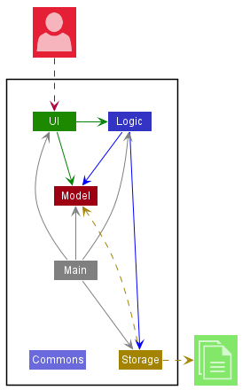

The ***Architecture Diagram*** given above explains the high-level design of the App.

Given below is a quick overview of main components and how they interact with each other.

**Main components of the architecture**

**`Main`** has two classes called [`Main`](https://github.com/AY2122S1-CS2103T-W13-3/tp/blob/master/src/main/java/seedu/gamebook/Main.java) and
[`MainApp`](https://github.com/AY2122S1-CS2103T-W13-3/tp/blob/master/src/main/java/seedu/gamebook/MainApp.java). It is responsible for,
* At app launch: Initializes the components in the correct sequence, and connects them up with each other.
* At shut down: Shuts down the components and invokes cleanup methods where necessary.

[**`Commons`**](#common-classes) represents a collection of classes used by multiple other components.

The rest of the App consists of four components.

* [**`UI`**](#ui-component): The UI of the App.
* [**`Logic`**](#logic-component): The command executor.
* [**`Model`**](#model-component): Holds the data of the App in memory.
* [**`Storage`**](#storage-component): Reads data from, and writes data to, the hard disk.

**How the architecture components interact with each other**

The *Sequence Diagram* below shows how the components interact with each other for the scenario where the user issues the command `delete 1`.

Each of the four main components (also shown in the diagram above),

* defines its *API* in an `interface` with the same name as the Component.
* implements its functionality using a concrete `{Component Name}Manager` class (which follows the corresponding API
  `interface` mentioned in the previous point.

For example, the `Logic` component defines its API in the `Logic.java` interface and implements its functionality using
the `LogicManager.java` class which follows the `Logic` interface. Other components interact with a given component
through its interface rather than the concrete class (reason: to prevent outside component's being coupled to the
implementation of a component), as illustrated in the (partial) class diagram below.

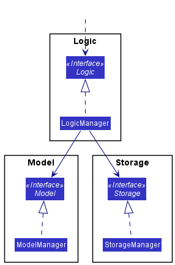

The sections below give more details of each component.

### UI component

The **API** of this component is specified in [`Ui.java`](https://github.com/AY2122S1-CS2103T-W13-3/tp/blob/master/src/main/java/seedu/gamebook/ui/Ui.java)

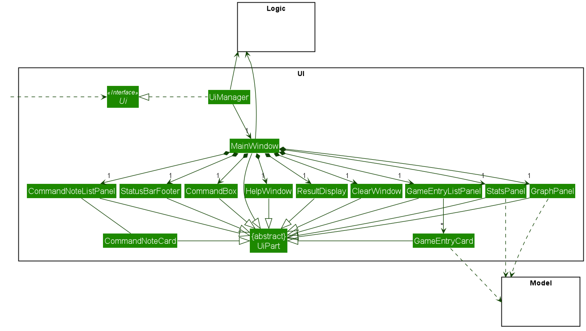

The UI consists of a `MainWindow` that is made up of parts e.g. `CommandBox`, `ResultDisplay`, `GameEntryListPanel`,
`StatusBarFooter` etc. All these, including the `MainWindow`, inherit from the abstract `UiPart` class which captures
the commonalities between classes that represent parts of the visible GUI.

The `UI` component uses the JavaFx UI framework. The layout of these UI parts are defined in matching `.fxml` files
that are in the `src/main/resources/view` folder. For example, the layout of the
[`MainWindow`](https://github.com/AY2122S1-CS2103T-W13-3/tp/blob/master/src/main/java/seedu/gamebook/ui/MainWindow.java)
is specified in [`MainWindow.fxml`](https://github.com/AY2122S1-CS2103T-W13-3/tp/blob/master/src/main/resources/view/MainWindow.fxml)

The `UI` component,

* executes user commands using the `Logic` component.
* listens for changes to `Model` data so that the UI can be updated with the modified data.
* keeps a reference to the `Logic` component, because the `UI` relies on the `Logic` to execute commands.
* depends on some classes in the `Model` component, as it displays `GameEntry` object residing in the `Model`. The graph
and statistics displays also depend on `GameEntryList`.

Below is a sequence diagram that shows how some of the Ui components interact when a command is executed. (in this case a `delete` command)

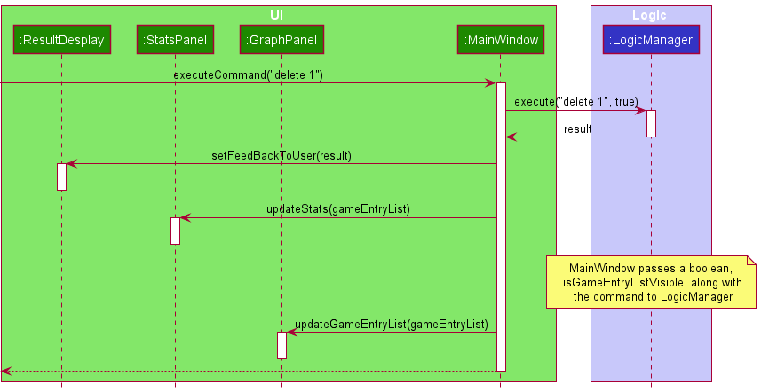

### Logic component

**API** : [`Logic.java`](https://github.com/AY2122S1-CS2103T-W13-3/tp/blob/master/src/main/java/seedu/gamebook/logic/Logic.java)

Here's a (partial) class diagram of the `Logic` component:

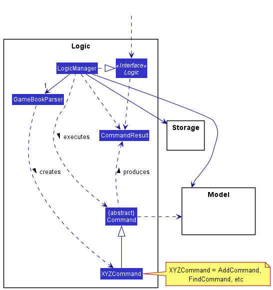

How the `Logic` component works:
1. When `Logic` is called upon to execute a command, it uses the `GameBookParser` class to parse the user's command.
2. Along with the user's command, `GameBookParser` uses additional information about the 
UI to determine what kind of command to parse for. 
3. This results in a `Command` object (more precisely, an object of one of its subclasses e.g., `AddCommand`) which is executed by the `LogicManager`.
4. The command can communicate with the `Model` when it is executed (e.g. to add a game entry).
5. The result of the command execution is encapsulated as a `CommandResult` object which is returned back from `Logic`.

The sequence diagram below illustrates the interactions within the `Logic` component for the `execute("delete 1")` API call.  

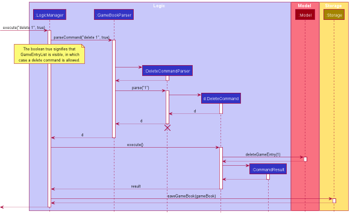
 

:information_source: **Note:** The lifeline for `DeleteCommandParser` and `DeleteCommand` should end at the 
destroy marker (X) but due to a limitation of PlantUML, the lifeline reaches the end of diagram.

Here are the other classes in `Logic` (omitted from the class diagram above) that are used for parsing a user command:

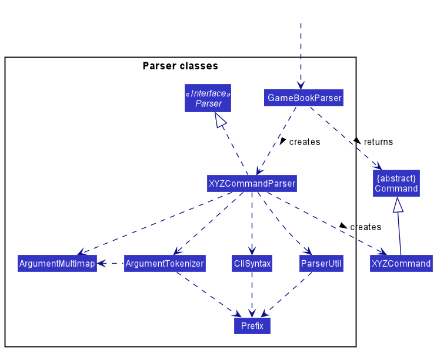

How the parsing works:
* When called upon to parse a user command, the `GameBookParser` class creates an `XYZCommandParser` (`XYZ` is a
  placeholder for the specific command name e.g., `AddCommandParser`) which uses the other classes shown above to parse
  the user command and create a `XYZCommand` object (e.g., `AddCommand`) which the `GameBookParser` returns back as a `Command` object.
* All `XYZCommandParser` classes (e.g., `AddCommandParser`, `DeleteCommandParser`, ...) inherit from the `Parser`
  interface so that they can be treated similarly where possible e.g, during testing.

### Model component
**API** : [`Model.java`](https://github.com/AY2122S1-CS2103T-W13-3/tp/blob/master/src/main/java/seedu/gamebook/model/Model.java)

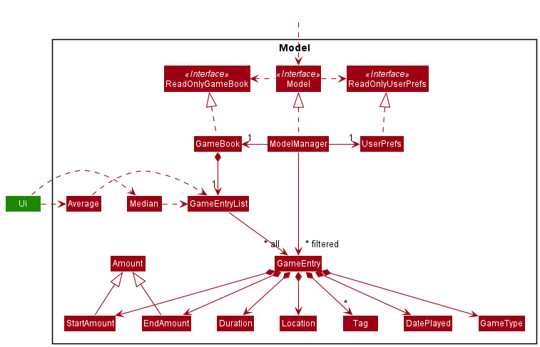

The `Model` component,

* stores the game book data i.e., all `GameEntry` objects (which are contained in a `GameEntryList` object).
* stores the currently 'selected' `GameEntry` objects (e.g., results of a search query) as a separate _filtered_ list
  which is exposed to outsiders as an unmodifiable `ObservableList<GameEntry>` that can be 'observed' e.g. the UI can
  be bound to this list so that the UI automatically updates when the data in the list change.
* stores a `UserPref` object that represents the user’s preferences. This is exposed to the outside as a `ReadOnlyUserPref` objects.
* does not depend on any of the other three components (as the `Model` represents data entities of the domain, they
  should make sense on their own without depending on other components)

### Storage component

**API** : [`Storage.java`](https://github.com/AY2122S1-CS2103T-W13-3/tp/blob/master/src/main/java/seedu/gamebook/storage/Storage.java)

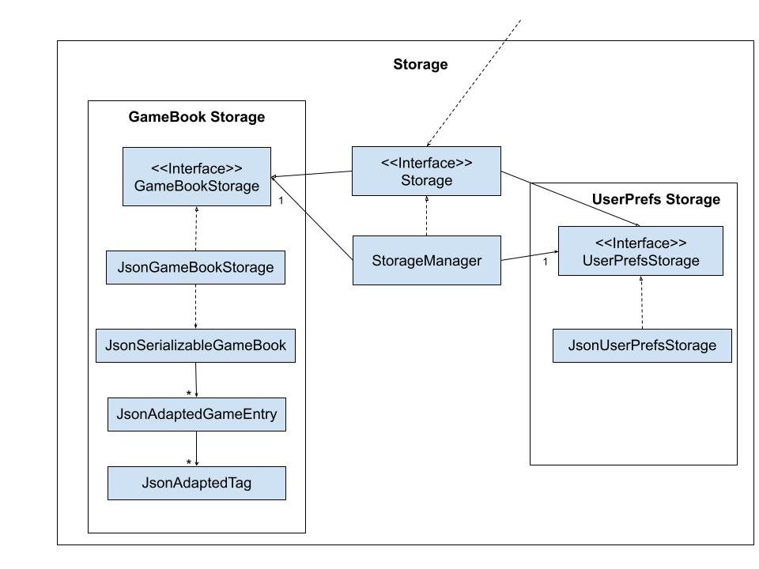

The `Storage` component helps save Game Book data and User Preferences to a json file after every use, and read them from a json file while restarting the app.
* The `Storage` component also plays a key role in supporting other functions such as the analysis of average profits.
* It inherits from both `GameBookStorage` and `UserPrefsStorage`, which means it can be treated as either one.
* It depends on some classes in the `Model` component (because the `Storage` component's job is to save/retrieve objects that belong to the `Model`)

### Common classes

Classes used by multiple components are in the `seedu.gamebook.commons` package.

--------------------------------------------------------------------------------------------------------------------

## **Implementation**

This section describes some noteworthy details on how certain features are implemented.

### Adding a game entry

The below provides a step-by-step break down of the mechanism for adding a game entry. Assume that the user has already
launched `GameBook` and the app has loaded data from storage.

1. The user inputs a command, such as `add /g Poker /p 35 /dur 40m /loc Resort World Sentosa Casino
   /dur 50m /date 2021-10-21 15:10` which calls upon `MainWindow#executeCommand()`.
2. `MainWindow#executeCommand()` passes the user's input to `LogicManager#execute()`to process, which calls upon `GameBookParser#parseCommand()`.
3. `GameBookParser#parseCommand()` parses the input with the help of `AddCommandParser#parse()`. If input is valid, a new `GameEntry` object is created,
   followed by an `AddCommand` object containing the `GameEntry`. The `AddCommand` object is then returned by `GameBookParser#parseCommand()`. 
4. `LogicManager#execute()` executes `AddCommand` by calling `AddCommand#execute()`, which adds the new entry to a `List` and sorts it by date.
5. `AddCommand#execute()` then encapsulates the result of the command execution in a new `CommandResult` object
   to its caller, `LogicManager#execute()`.
6. `LogicManager#execute()` calls `Storage` to store the new game entry list and returns `CommandResult` to `MainWindow#executeCommand()`.
7. `MainWindow#executeCommand()` executes `resultDisplay#setFeedbackToUser()` to display the message from `CommandResult` to the user.
8. `MainWindow#executeCommand()` calls `StatsPanel#updateStats()` and `GraphPanel#updateGameEntryList()` to update the statistics and graph with the new game entry list.

The following activity and sequence diagrams illustrate the mechanism of adding a new game entry.
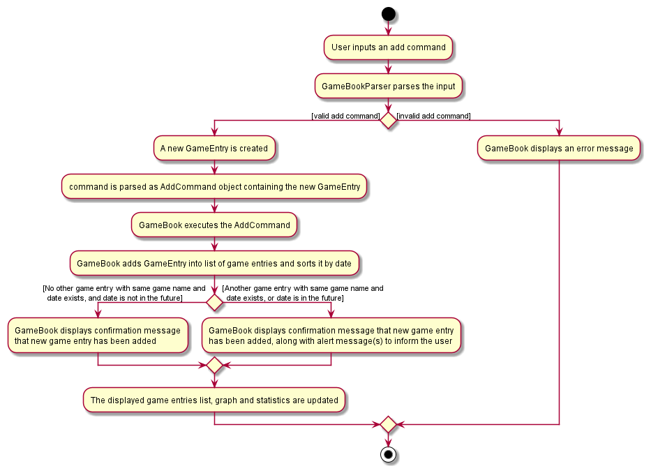

Note that the second sequence diagram is a continuation of the first.
.png)
.png)

:information_source: **Note:** The lifeline for `AddCommandParser` and `AddCommand` should end at the 
destroy marker (X) but due to a limitation of PlantUML, the lifeline reaches the end of diagram.

### Editing a game entry
Editing a game entry requires user input from the CLI. The `GameBook` parser will check the validity of the input. It
is valid if
* The list of games currently displayed is not empty, and the chosen index is a valid index.
* At least one field is chosen to be edited.
* The formats of all fields entered, such as game name, start amount, end amount, location etc must be in the correct format.

Assume that the user has already launched `GameBook` and the app currently displays this:
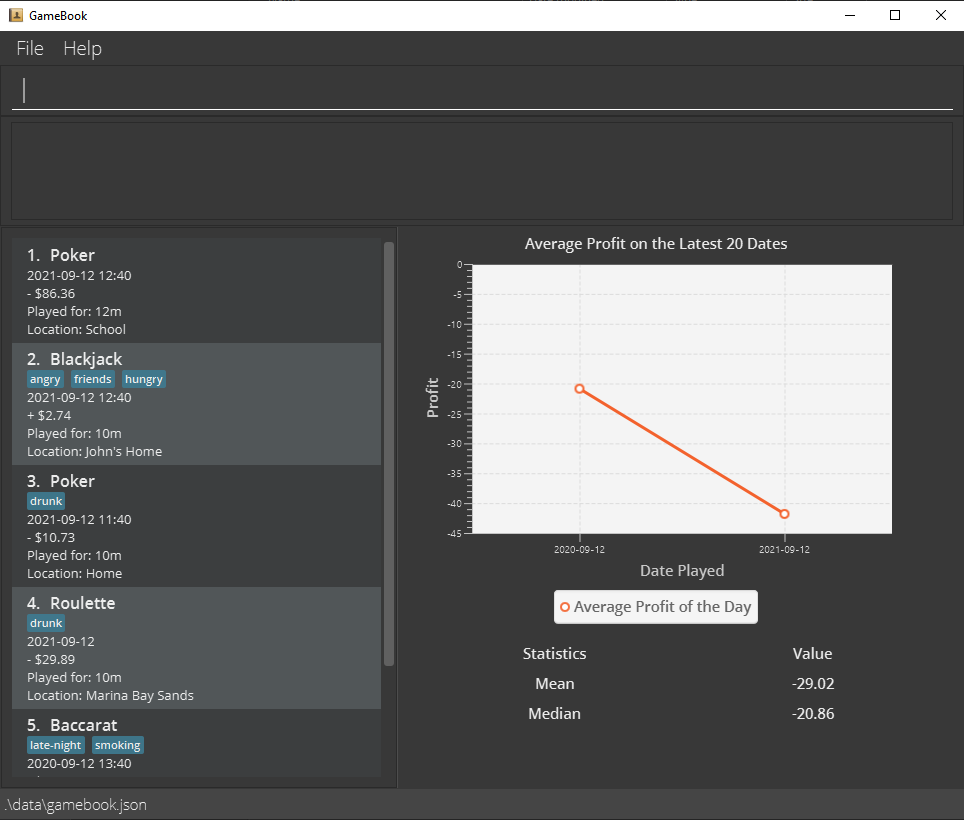

The below provides a step-by-step break down of the mechanism for editing a game entry.
1. The user inputs `edit 1 /g Mahjong` which calls upon which calls upon `MainWindow#executeCommand()`.
2. `MainWindow#executeCommand()` passes the user's input to `LogicManager#execute()` to process.
3. `LogicManager#execute()` calls `GameBookParser#parseCommand()` to parse the input.
4. `GameBookParser#parseCommand()` parses the input and returns an `EditCommand`.
5. `LogicManger#execute()` executes `EditCommand` by calling `EditCommand#execute()`.
6. `LogicManager#execute()` selects the `GameEntry` to be edited, creates an edited copy of it, and calls `ModelManager#setGameEntry()`
   to replace the original `GameEntry` with the edited one. It then returns a `CommandResult` to `LogicManager#execute()`.
7. `LogicManager#execute()` calls `Storage` to store the new game entry list and returns `CommandResult` to `MainWindow#executeCommand()`.
8. `MainWindow#executeCommand()` executes `resultDisplay#setFeedbackToUser()` to display the message from `CommandResult` to the user.
9. `MainWindow#executeCommand()` calls`StatsPanel#updateStats()`and `GraphPanel#updateGameEntryList()` to update the
   statistics and graph with the new game entry list.

The following diagrams illustrates the process of executing an `edit` command. The Ui components for the sequence diagram
are omitted as it is very similar to the first half of the sequence diagram under "Adding a GameEntry" above.

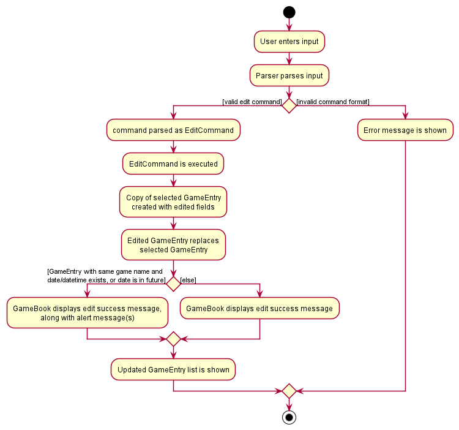  
.png)

:information_source: **Note:** The lifeline for `EditCommandParser` and `EditCommand` should end at the 
destroy marker (X) but due to a limitation of PlantUML, the lifeline reaches the end of diagram.

### Deleting a game entry
Deleting a game entry requires user input from the CLI. The format of input should
be `delete [INDEX]`.
The user should obtain the index of the game entry to be deleted
from the `GameEntryList`, which will show a list of game entries previously added or filtered by the user.`
GameBookParser` will check for the validity of the input. It is valid if
* The index specified by the user is bigger than 0 and smaller or equal to the number of game entries in the displayed list.
* `GameEntryList` is currently displayed. 

The below provides a step-by-step break down of the mechanism for deleting a game entry. Assume that the user has already
launched `GameBook` and the app has loaded data from storage. Assume also that the `GameEntryList` is displayed and 
contains more than 1 game entry.
1. The user inputs `delete 1` which calls upon `MainWindow#executeCommand()`.
2. `MainWindow#executeCommand()` passes the user's input and information about the UI to `LogicManager#execute()` to process.
3. `LogicManager#execute()` calls `GameBookParser#parse()` to parse the input while taking account of the UI condition (whether `GameEntryList` is visible to the user).
4. `GameBookParser#parse()` parses the input and returns a `DeleteCommand`.
5. `LogicManger#execute()` executes `DeleteCommand` by calling `DeleteCommand#execute()`.
6. `DeleteCommand#execute()` calls `ModelManager#deleteGameEntry()` to delete the game entry from the game entry
   list and returns a `CommandResult`to `LogicManager#execute()`.
7. `LogicManager#execute()` calls `Storage` to store the new game entry list and returns `CommandResult` to `MainWindow#executeCommand()`.
8. `MainWindow#executeCommand()` executes `ResultDisplay#setFeedbackToUser()` to display the message from `CommandResult` to the user.
9. `MainWindow#executeCommand()` calls`StatsPanel#updateStats()`and `GraphPanel#updateGameEntryList()` to update the 
statistics and graph with the new game entry list. 

Below is an activity diagram for a delete command.  
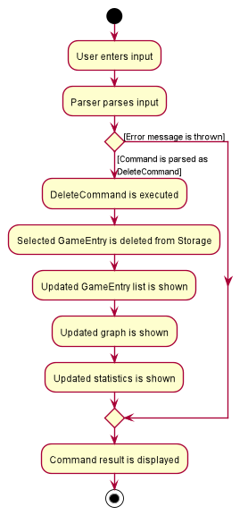
 
Please refer to the sequence diagrams in [UI Component](#ui-component) and [Logic Component](#logic-component) for
details about how classes in UI and Logic interact to execute a delete command.

### Finding game entries
Finding a game entry requires user input from the CLI. Multiple keywords can be used to search the list using the format 
`find [KEYWORD_1] [KEYWORD_2] ...`. By calling `find [KEYWORD]` the `GameName`, `Location` and `Tags` of the game entries 
in the `GameEntryList` are searched, and the game entries containing the input keywords are displayed in the list. 
A blank or empty keyword is considered as an invalid, and if the game entries in the list don't contain the keyword, 
an empty list is displayed. The validity of the input command is checked by `GameBookParser`. 

The below provides a step-by-step breakdown of the mechanism of finding game entries. Assume that the user has already 
launched GameBook, and the app has loaded data from storage. Also assume that the displayed list contains more than 1 game entry 
and contains a game entry with `GameName` "Poker".
1. The user inputs `find poker` which calls `MainWindow#executeCommand()`. 
2. `MainWindow#executeCommand()` passes the user's input and UI information to `LogicManager#execute()` to process. 
3. `LogicManager#execute()` calls `GameBookParser#parse()` which checks the validity of the command then parses the input.  
   Since the input and command format are valid, no error message is displayed.
4. Next, a `GameEntryContainsKeywordPredicate` is created with the search keywords
5. After parsing the input, a FindCommand is created and returned with the `GameEntryContainsKeywordPredicate` which is then 
   executed by calling `FindCommand#execute()`
6. Then the `filteredGameEntries` list is updated with the `GameEntryContainsKeywordPredicate` by calling `Model#updateFilteredGameEntryList()`
7. `FindCommand#execute()` returns a `CommandResult` which contains the number of entries matching the search keyword 
8. The `CommandResult` is displayed to the user when `ResultDisplay#setFeedbackToUser()` is called by `MainWindow#executeCommand()`
9. `MainWindow#executeCommand()` calls`StatsPanel#updateStats()`and `GraphPanel#updateGameEntryList()` to update the
   statistics and graph with the new game entry list.
   
Below are the activity and sequence diagrams for the find command 

.png)

Please refer to the sequence diagrams in [UI Component](#ui-component) and [Logic Component](#logic-component) for
details about how classes in UI and Logic interact to execute a find command.

### Graphical analysis of game entries

GameBook also provides graphical analysis of average profits by Date.
This is facilitated by the `GraphPanel` and `Average` classes along with the `MainWindow` class. 
It is implemented using the JavaFX `LineChart` and `XYSeries` Classes.

`GraphPanel` currently supports two methods:
* `drawGraphOfLatestKDates(int)` - gets the TreeMap with the specified number of latest dates and average profits and adds them to the series and 
  the line chart.
* `updateGameEntryList()` - reassigns the value of the new GameEntry list to the current GameEntry list

In addition, the following method from `Average` is also used:
* `Average#getAverageData()` - returns a TreeMap with the dates as values and average profit as keys

Found below is a step-by-step break down of the mechanism of creating and updating the graph: 
1. Upon initialising the `MainWindow`, a new `GraphPanel` is created with the game entry list from `logic`.
   During this, a new `XYChart.Series` is also initialised.
2. This new `GraphPanel` is then added to the `graphPanelPlaceholder` in the main window after which 
   `GraphPanel#drawGraphOfLatestKDates(int)` is called with the k value of `ModelManager.NUMBER_OF_DATES_TO_PLOT` which is set to 20.
3. When `GraphPanel#drawGraphOfLatestKDates(int)` is called, the data for average profits is added to the `averageProfits` TreeMap by 
   calling `Average#getAverageData(ObservableList<GameEntry>)`on the game entry list.
4. Then, the line chart is cleared, and the series is added to the line chart
5. The series is then cleared and then the data from the latest k dates from `averageProfits` is added to the series, after which the 
   graph is plotted.
6. After executing a command, the graph panel is updated by calling the `GraphPanel#updateGameEntryList(ObservableList<GameEntry>)` method
    on the graph panel with the updated game entry list. 
7. This resets the value of the current game entry list in the graph panel to the updated game entry list and the graph 
   is drawn again by calling the `GraphPanel#drawGraph()` method.
   
* A `GraphPanel` object is created and initialised in the main window using the filtered list from `Storage`
  `drawGraphOfLatestKDates(int)` is called on the graph panel to draw the graph based on existing entries as the user starts the app.
* When the user enters a command, `executeCommand(String)` in MainWindow is run which calls `GraphPanel#updateGameEntryList(ObservableList<GameEntry>)`
* This resets the value of the list and calls `drawGraphOfLatestKDates(int)` resulting in a new series being created with `Average#getAverageData(ObservableList<GameEntry>)`,
  to generate a new graph
* These steps repeat for every command entered by the user until the user exits the app.

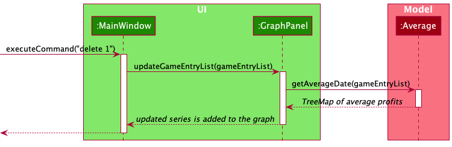

### Additional Game Statistics 

In addition to the graphical analysis of profits, GameBook also provides additional statistical data for the total 
average and median profit generated. This is done by the `stats.Average` and `stats.Median` classes. 

The `Average` class contains the `Average#getOverallAverage(List<GameEntry>)` method which returns average profit value of all the 
game entries in the list as a `Double` value. The `Median` class contains the `Median#getOverallMedian(List<GameEntry>)` method which returns the 
median profit value of all entries in the list as a `Double` value. 

These methods are then called in the `StatsPanel` class in the UI. The `StatsPanel` class contains
2 methods - `StatsPanel#getStats()` and `StatsPanel#updateStats(ObservableList<GameEntry>)` which are used to set the 
text fields in the UI to the Average and Median values respectively. 

Found below is a step-by-step break down of the mechanism of updating the statistics:
* When the `MainWindow` is initialised, a `StatsPanel` object is created and initialised using a `ObservableList<GameEntry>`
    The values for average and median profit are initialised 0.00 for an empty list
* As the list is updated, `StatsPanel#updateStats(ObservableList<GameEntry>)` is called from `MainWindow` which updates the
  current `ObservableList<GameEntry>` with the new `ObservableList<GameEntry>` and `StatsPanel#getStats()` is called
* Subsequently, `StatsPanel#getStats()` calls the `Average#getOverallAverage(List<GameEntry>)` and `Median#getOverallMedian(List<GameEntry>)`
methods which recalculates the value of the mean and median and resets the value of the text fields in the UI.

--------------------------------------------------------------------------------------------------------------------

## **Appendix: Additional Guides**

* [Documentation guide](Documentation.md)
* [Testing guide](Testing.md)
* [Logging guide](Logging.md)
* [Configuration guide](Configuration.md)
* [DevOps guide](DevOps.md)

--------------------------------------------------------------------------------------------------------------------

## **Appendix: Requirements**

* [Product scope](#product-scope)
* [User stories](#user-stories)
* [Use cases](#use-cases)
* [Non-Functional Requirements](#non-functional-requirements)
* [Glossary](#glossary)

### Product scope

**Target user profile**:

* has a need to track earnings/losses across various casino games
* prefer desktop apps over other types
* can type fast
* prefers typing to mouse interactions
* is reasonably comfortable using CLI apps

**Value proposition**: manage gambling earnings/losses faster than a typical mouse/GUI driven app

### User stories

Priorities: High (must have) - `* * *`, Medium (nice to have) - `* *`, Low (unlikely to have) - `*`

| Priority | As a …​                                    | I want to …​                     | So that I can…​                                                        |
| -------- | ------------------------------------------ | ------------------------------ | ---------------------------------------------------------------------- |
| `* * *`  | new user                                   | add a new game entry         | keep track of my games                 |
| `* * *`  | new user                                   | delete my game entries         | clear entries with erroneous data                 |
| `* * *`  | new user                                   | log my gambling statistics on a per game basis    | keep track of my spending                 |
| `* * *`  | new user                                   | input any type of game         | include any game I want instead of choosing from a preset list of games                 |
| `* * *`  | new user                                   | save my net earnings and losses         | view data from my previous games                 |
| `* * *`  | forgetful user                             | edit my previous game entries         | add details I missed out on previously                 |
| `* *`    | user who frequents multiple gambling locations   | input location I played at               | organize and sort my data by location                                                                       |
| `* *`    | user who does not like scrolling                | find game entries using relevant keywords                | view my data quickly                                  |
| `* *`    | expert user                | see analysis of my game statistics               | evaluate my game performance                                   |
| `* *`    | user who vlogs                | view an aesthetically pleasant UI                | show it to my audience in my videos                                   |
| `* *`    | user who is easily affected by emotions                | tag games which I made emotional decisions in                | understand how it has affected my earnings                                   |
| `* *`    | user who gambles frequently                | see the statistics on my expenditure                | justify my gambling habits to my family, that it is not an addiction                              |
| `*`      | user who switches between computers frequently | backup my data securely           | easily create copies of it to other computers                                                 |
| `*`      | user whose hard drive is almost full | specify where the app data is stored           | so that I can save to another drive instead of my almost full hard drive                                                 |
| `*`      | user who gambles against friends frequently | analyze my performance when playing against specific friends           | avoid betting large amounts when playing against stronger friends                                                 |
| `*`      | busy user | see how much time I spend on each game           | utilize my time better                                                 |
| `*`      | busy user | see the profit per unit time analysis of different games           | decide which game to play to maximize rate of earnings                                                 |
| `*`      | expert user | see the statistics of games with specific tags           | evaluate my performance on games with the selected tags                                                 |
| `*`      | expert user | compare statistics across different days of the week           | evaluate my performance on different days                                                 |
| `*`      | thrillseeking user | see mean and variance calculations for different games           | choose the one with the highest variance to have fun                                                 |
| `*`      | user who frequents places with an entry fee | add costs such as entry-fee into the overall calculation           | get a more accurate view of my profits                                                 |
| `*`      | organized user | save different filters or sort conditions           | quickly view custom selections that are important to me                                                 |
| `*`      | user who loves alcohol | tags games that I played when I am drinking           | see how alcohol affect my performance                                                |

### Use cases

(For all use cases below, the **System** is the `GameBook` and the **Actor** is the `user`, unless specified otherwise)

**Use case: Add an entry**

**MSS**

1. User requests to add a new game entry.
2. GameBook adds in the new entry and displays a success message, along with any accompanying warnings.

   Use case ends.

**Extensions**

* 1a. User entered the entry in an incorrect format.
  * 1a1. GameBook shows an error message, telling the user the correct command format.

  Use case resumes at step 1.
  
  
**Use case: View entries**

**MSS**

1. User requests to list all entries.
2. GameBook shows all entries.

   Use case ends.

**Extensions**

* 1a. User requests to <u>find entries by keyword (UC01)</u>.
    * 1a1. GameBook shows a filtered list of entries. 
      
    Use case ends.

**Use case: Edit an entry**

**MSS**

1. User requests to edit a game entry.
2. GameBook updates itself with the edited entry, and displays a success message, along with any accompanying warnings.

   Use case ends.

**Extensions**

* 1a. User entered the edit command in an incorrect format.
    * 1a1. GameBook shows an error message, telling the user the correct command format.

      Use case resumes at step 1.
    
* 1b. User does not choose any field to edit
    * 1b1. GameBook shows an error message, telling the user to select at least 1 field to edit.
    
      Use case resumes at step 1.
    
* 1c. User's edit does not change at least one field of the selected game entry.
    * 1c1. GameBook shows an error message, telling the user that the selected edit does not change the selected game entry.

      Use case resumes at step 1.
    
**Use case: Delete an entry**

**MSS**

1. User requests to see the game entry list by inputting `list`.
2. GameBook displays the game entry list.
3. User requests to delete a specific entry in the displayed game entry list.
4. GameBook deletes the entry and shows a command success message.

    Use case ends.

**Extensions**

* 1a. User requests to delete an entry when game entry list is not displayed.
    * 1a1. GameBook shows an error message, telling the user the correct command format.
  
      Use case resumes at step 1.
* 1b. User uses `find KEYWORDS` to find specific game entries in the GameBook.
    * 1b1. GameBook displays a list of matching game entries. 

      Use case resumes at step 3.
  
* 3a. User requests to delete a game entry that does not exist in the displayed game list. (User provides an invalid index.)
  * 3a1. GameBook shows an error message.
  
      Use case resumes at step 3.   

**Use case: Finding an entry** 

**MSS** 

1. User wishes to find game entries based on a given search keyword
2. User inputs the `find` command with the desired keyword(s) as the parameter
3. GameBook displays the entries which have an exact match with the keyword
    
    Use case ends. 

**Extensions**

* 2a. User doesn't enter a keyword or enters an empty keyword 
    
    * 2a1. GameBook shows an error message, telling the user the correct command format.
      
        Use case resumes at step 2. 
    
* 3a. The GameEntry List is empty 
    
    * 3a1. GameBook displays `0 game entries listed!`
    
        Use case ends

**Use case: Clear all entries**

**MSS**

1. User requests to clear all entries
2. GameBook prompts for confirmation
3. User confirms
4. The list is cleared

    Use case ends.

**Extensions**

* 3a. User cancels the operation

    Use case ends.

**Use case: Find help**

**MSS**

1. User requests for help
2. A link is provided

   Use case ends.

**Extensions**

* 3a. User cancels the operation

  Use case ends.

### Non-Functional Requirements

1. Should work on any _mainstream OS_ as long as it has Java `11` or above installed.
2. Should be able to hold up to 1000 entries without a noticeable sluggishness in performance for typical usage.
3. A user with above average typing speed for regular English text (i.e. not code, not system admin commands) should be able to accomplish most of the tasks faster using commands than using the mouse.
4. A novice should be able to grasp the basic functionalities of the system without too much difficulty.
5. The user interface should be clear, so that new users can use the app without too much difficulty.
6. A user should be able to easily back up data.
7. The product is offered for free online.

### Glossary

* **Mainstream OS**: Windows, Linux, Unix, OS-X
* **GUI**: Graphical User Interface

--------------------------------------------------------------------------------------------------------------------

## **Appendix: Manual testing**

* [Launch and shutdown](#launch-and-shutdown)
* [Add Command](#add-command)
* [Edit Command](#edit-command)
* [Delete Command](#delete-command)
* [Find Command](#find-command)
* [Saving data](#saving-data)

Given below are instructions to test the app manually.

:information_source: **Note:** These instructions only provide a starting point for testers to work on;
testers are expected to do more *exploratory* testing.

### Launch and shutdown

1. Initial launch

    1. Download the jar file and copy into an empty folder

    1. Double-click the jar file Expected: Shows the GUI with a set of sample contacts. The window size may not be optimum.

1. Saving window preferences

    1. Resize the window to an optimum size. Move the window to a different location. Close the window.

    1. Re-launch the app by double-clicking the jar file. 
       Expected: The most recent window size and location is retained.
       

### Add Command
1. Adding a game entry:
   1. Test case: `add /g poker /s 20 /e 34 /date 2021-11-05 10:15`
      
      Expected: A new poker entry with $14 profit played on 2021-11-05 10:15 is added into the list of game entries, which
      is sorted by date.
   2. Test case: `add /g poker /p 30 /date 2021-11-05 10:15`
      
      Expected (assuming this command is executed after (i)): A new poker entry with $30 profit played on 2021-11-05 10:15 is added into the list of game entries, which
      is sorted by date. GameBook also displays an alert to inform the user that an entry with the same name and date already
      exists.
   3. Test case: `add /g blackjack`

      Expected: GameBook displays an error message, because user must provide a way for GameBook to know the profit, either
      by providing start amount (/s) and end amount (/e), or by providing profit directly (/p).
   4. Other incorrect add commands to try: `add`, `add /g poker /p ten`, `add /g poker /p 30 /date 1st january`.

### Edit Command

Suppose GameBook currently displays this: 

1. Editing a game entry while the list of games displayed is not empty.

    1. Prerequisites: The list of games shown is non-empty.

    1. Test case: `edit 1 /g mahjong` 
       Expected: First game entry has its name change from `Poker` to `Mahjong`. No other changes are observed.

    1. Test case: `edit 1 /date 2021-09-21 12:39` 
       Expected: First game is now at index 2, while the game originally at index 2 is now at index 1. The list of games shown are still sorted by date.

    1. Test case: `edit 0 ...` 
       Expected: No game entry is edited. Error details shown in the status message.

    1. Other incorrect edit commands to try: `edit x`, `edit y /s 10`, `edit y /someWrongFlag`, `...` (where x is larger than list size, and y is a valid index) 
       Expected: Similar to previous.
       

### Delete Command
Note: Use `list` to display the whole game entry list or `find [KEYWORDS]` to display a filtered list.
1. Deleting a game entry while a list of game entries is shown. For this test, assume that the size of the list is larger than 1. 
    
   1. Test case: `delete 1` 
       Expected: First game entry is deleted from the list. Details of the deleted game shown in the status message.

   2. Test case: `delete 0` 
       Expected: No game entry is deleted. Error details shown in the status message.

   3. Other incorrect delete commands to try: `delete`, `delete x`, `...` (where x is larger than the list size) 
       Expected: Similar to previous.
       
2. Deleting a game entry while no list of game entries is shown.

   1. Test case: `delete 1` 
       Expected: No game entry is deleted. Error details shown in the status message.
    
       

### Find Command

1. Finding a game entry when the list of game entries is empty 
    
    1. Test case: `find poker`  
    Expected: `0 game entries listed!`
       
    1. Test case: `find`   
    Expected: Invalid command. Error message is displayed

2. Finding game entries when the list of game entries is not empty 

    1. Test case: `find poker` [finding by `GameName`] 
    Expected: The resulting list contains all the game entries which have its `GameName` as "poker". If there are no entries that match 
       the search pattern then `0 game entries listed!` is displayed
       
    2. Test case: `find home` [finding by `Location`]  
    Expected: The resulting list contains all the game entries which have its `Location` as "home". If there are no entries that match
       the search pattern then `0 game entries listed!` is displayed
    
    3. Test case: `find birthday` [finding by `Tag`]  
    Expected: The resulting list contains all the game entries which have are tagged as "birthday". If there are no entries that match
       the search pattern then `0 game entries listed!` is displayed

    4. Test case: `find`  
      Expected: Invalid command. Error message is displayed   

  

### Saving data

1. Dealing with missing/corrupted data files
   
    1. Test case: Change the field of a game entry in `/data/gamebook.json` into an invalid argument for the field (eg. changing the startAmount to `abc123`) before opening GameBook.
        1. Note: Correct format of arguments can be found in our [User Guide](UserGuide.md).
    
        Expected: GameBook will open with an empty game list, and will overwrite the corrupted data file once a new game is added.
           
    1. Test case: Change the field of a game entry in `/data/gamebook.json` into an invalid argument for the field (eg. changing the startAmount to `abc123`) while GameBook is open, then do some operation that edits the game entry list.  
    Expected: GameBook will overwrite the erroneous data and continue functioning as per normal.
