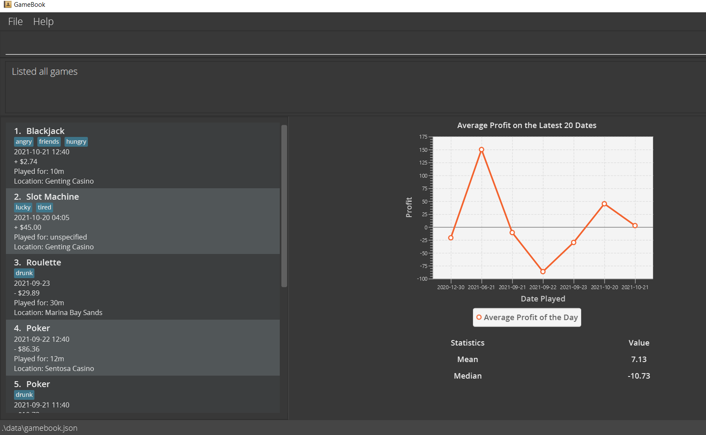
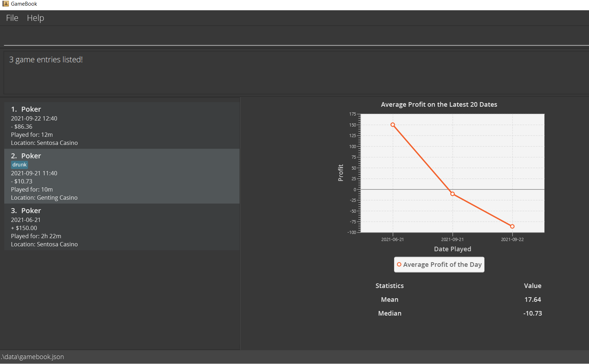
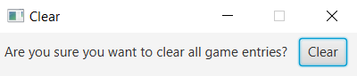

Welcome to **GameBook**!

**GameBook** is a desktop app designed for you to track your gambling performance.
With simple commands, you will be able to add your gambling sessions into **GameBook**
and view instant analysis of your gambling records.

If you enjoy casual gambling sessions with your friends and family or love going to the casinos, do try out **GameBook**!

## Table of Contents

* [Quick Start](#quick-start)

* [Terminology](#terminology)
    * [Syntax and Symbols used in the User Guide](#syntax-and-symbols-used-in-the-user-guide)
    * [Technical Terms](#technical-terms)
    * [GameEntry Fields](#gameentry-fields)
 
   
*  [Features](#features)
    * [Adding a game entry](#adding-a-game-entry-add)
    * [Listing all game entries](#listing-all-game-entries--list)
    * [Editing a game entry](#editing-a-game-entry--edit)
    * [Deleting a game entry](#deleting-a-game-delete)
    * [Finding game entries](#finding-game-entries-find)
    * [Clearing all game entries](#clearing-all-data-clear)
    * [Getting Help](#getting-help--help)
    * [Exiting the program](#exiting-the-program--exit)
    * [Saving the data](#saving-the-data)
    * [Editing the data file](#editing-the-data-file)
    * [Archiving data files](#archiving-data-files-coming-in-v20)

* [FAQ](#faq)

* [Command Summary](#command-summary)

--------------------------------------------------------------------------------------------------------------------
## Quick start

1. Ensure that you have Java 11 or above installed in your computer.
  * To check if you have Java 11 or above installed, open command prompt (search "cmd" on your computer) and type `java -version`.
    The command prompt will tell you if you have Java and which version you have. Proceed to step 2 if you have Java 11 or above installed.
  * If you do not have Java 11 or above installed, please visit the [Java installation guide](https://docs.oracle.com/en/java/javase/11/install/overview-jdk-installation.html#GUID-8677A77F-231A-40F7-98B9-1FD0B48C346A)
    and install Java 11 or above.

2. Download the latest `gamebook.jar` from [here](https://github.com/AY2122S1-CS2103T-W13-3/tp/releases).

3. Copy the JAR file to the folder you want to use as the home folder for **GameBook**. Your gambling records will later be saved in your home folder.

4. Double-click the JAR file to start the app. A window similar to below should appear in a few seconds.
    
   

5. Type the command in the command box and press “Enter” on your keyboard to execute it.  
   Here are some example commands that you can try:
   * **`add /g Poker /s 500 /e 650 /date 2021-06-21 /dur 142 /loc Sentosa Casino`**:  
     Adds an entry of Poker where you started with $500 and ended with $650 (played on 20th June 2021 for 142min at 
     Sentosa Casino) into the **GameBook**.
   * **`delete 2`** : Deletes the 2nd entry shown in the current list
   * **`help`** : Shows a list of commands available to use in **GameBook**.

6. Refer to the [Features](#features) section for more details of each command.

--------------------------------------------------------------------------------------------------------------------
## Terminology

### Syntax and Symbols used in the User Guide:

Format | Description
--------|------------------
**`command`** | Used to denote an input command
**:information_source:** | Used to signify important information/notes to the user
**:bulb:** | Used to indicate tips to the user
**:warning:** | Used to warn the user before proceeding with a potentially risky action

### Technical Terms:

Term | Description
--------|------------------
**parameter** | A parameter is a piece of information that the user needs to supply in a command.
**JSON** | Abbreviation of JavaScript Object Notation. Format in which the user's data is stored.

### GameEntry Fields:

:information_source: When looking at commands in the **Features** section, refer to here for the format of each parameter. 

Parameter | Description
--------|------------------
**GAME_TYPE** | Refers to the type of the game you wish to record. Eg: Poker, Roulette, Blackjack, etc.
**INITIAL_CASH** | The amount of cash you have at the beginning of a game, up to 2 decimal places. Value should be between -1,000,000,000.00 and 1,000,000,000.00
**FINAL_CASH** | The amount of cash you have at the end of a game, up to 2 decimal places. Value should be between -1,000,000,000.00 and 1,000,000,000.00
**PROFIT** | The overall gain/loss from the game. Effectively, the difference between `FINAL_CASH` and `INITIAL_CASH`, up to 2 decimal places. Value should be between -1,000,000,000.00 and 1,000,000,000.00
**DATE** | The date on which the game was played. Date should be in `yyyy-MM-dd` or `yyyy-MM-dd HH:mm` format. If `DATE` is not specified, it will be taken to be the current time of input.
**DURATION** | The amount of time for which the game was played. Duration should be in `INTh:mm`, `INTh INTm`, `INTh` or `INTm` or `INT` format. (`INT` represents an integer) Eg:   `1:30`, `1h 30m` represents 1 hour 30 minutes   `1h`, `60m`, `60` represents 1 hour
**LOCATION** | The place where the game was played
**TAG** | A single word (or dash-separated words) attribute assigned to the game which can be used to categorize the game. Eg: `birthday`, `very-lucky`, etc.

:warning: **Alert:**
 Numbers larger than one billion or smaller than negative one billion are not supported by **GameBook**.

--------------------------------------------------------------------------------------------------------------------
## Features

**:information_source: Notes about the command format and input:** 

* Words in `UPPER_CASE` are the parameters to be supplied by the user. 

  e.g. In `add /g GAME_TYPE /s INITIAL_CASH /e FINAL_CASH`, GAME_TYPE, INTIIAL_CASH, and FINAL_CASH are
  parameters the user needs to supply. An example is `add /g poker /s 0.01 /e 1.02`.

* Items in square brackets are optional. 

  e.g. In `add /g GAME_TYPE /p PROFIT [/date DATE] [/dur DURATION] [/loc LOCATION] [/tag TAGS]`, DATE, DURATION,
  LOCATION and TAGS are optional fields. `add /g poker /p 10.40` and `add /g poker /p 10.40 /date 2021-09-11 21:20 /dur 40` are both deemed
  as correct usages.

* Extraneous parameters for commands that do not take in parameters (such as `list`, `exit` and `clear`) will be ignored.
  e.g. if the command specifies `list 123`, it will be interpreted as `list`

* Empty parameters are not allowed and will result in an error message. 
e.g. `... /date /tag` will result in an error message.

**:information_source: Notes about the displayed list:** 

* Displayed list of game entries is implicitly sorted by date.
  * Game entries with later dates are displayed above game entries with earlier dates.
  * If the DATE specified does not contain time, it will be regarded as 00:00 when sorting.

### Adding a game entry: `add`

Adds a game entry to **GameBook**. 

Parameters: 
`GAME_TYPE`, `[INITIAL_CASH]`, `[FINAL_CASH]`, `[PROFIT]`, `[DATE]`, `[DURATION]`, `[LOCATION]`, `[TAGS]`   
Format: 
`add /g GAME_TYPE [/s INITIAL_CASH] [/e FINAL_CASH] [/p PROFIT] [/date DATE] [/dur DURATION] [/loc LOCATION] [/tag TAGS]`  

:bulb: **Tip:**
You must specify the amount of money you won or lost in the game. You can choose to input the INITIAL_CASH with the FINAL_CASH or only input the PROFIT.  

* To simplify typing, for GAME_TYPE and LOCATION, the input will be automatically converted such that the first
  character of each word is upper-case and subsequent characters are lower-case. For example, "poker" and "genting casino"
  will be stored within **GameBook** as "Poker" and "Genting Casino" respectively.
* A game entry can have any number of TAGS (including 0). If you want to add multiple tags, follow the format of `/tag TAG_1, TAG_2, TAG_3, ...` where
each tag is separated by a comma. 
  * eg. `/tag drunk,lucky`
* Please refer to [GameEntry Fields](#gameentry-fields) for specific notes on the formats of the parameters.

Examples:
* `add /g blackjack /s 12.34 /e -56.78 /date 2021-09-13 /dur 1:23 /loc Marina Bay Sands` 
Adds an entry of blackjack where you started with $12.34 and ended with -$56.78 (played on 13th Sept. 2021 for 1hr 23 min
at Marina Bay Sands) to **GameBook**.
* `add /g poker /s 0.01 /e 1.02 /date 2021-09-11 21:20 /dur 3:14 /loc Home` 
Adds an entry of poker where you started with $0.01 and ended with $1.02 (played on 11th Sept. 2021 21:20  for 3hr 14 min
at Home) to **GameBook**.
* `add /g poker /p 0.2 /tag run-good` 
  Adds an entry of poker where you gained a profit of $0.20 to **GameBook** and tags the entry as "run-good".

**:information_source: Note about alerts:** 

* If the specified DATE is in the future, an alert will be shown.
* If an existing entry already has the same GAME_TYPE and DATE, an alert will be shown.
  * Two DATEs are the same if they fall on the exact same time (if time is specified for both), or if they fall on the same
  day (if time is not specified for both). 
    * Eg of DATEs regarded as same: `2020-01-01` and `2020-01-01`; `2020-01-01 10:15` and `2020-01-01 10:15`.
    * Eg of DATEs regarded as different: `2020-01-01` and `2020-01-05`; `2020-01-01` and `2020-01-01 07:30`

### Listing all game entries : `list`

Shows a list of all game entries in **GameBook**. 

Format: 
`list`

 

### Editing a game entry : `edit`

Edits an existing game entry in **GameBook**.  

Parameters: 
- `INDEX` - Numbers from 1-999
- `[GAME_TYPE]`
- `[PROFIT]`, `[DATE]`, `[DURATION]`, `[LOCATION]`, `[TAGS]`  
Format: 
`edit INDEX [/g GAME_TYPE] [/p PROFIT] [/date DATE] [/dur DURATION] [/loc LOCATION] [/tag TAGS]`

:exclamation: **Caution:**
You are not allowed to edit INITIAL_CASH and FINAL_CASH. That is, do not use `/s` and `/e`. Only use profit, `/p`.

* Edits the game record at the specified `INDEX`. `INDEX` refers to the index of the game within the displayed game list, which
  **must be a positive integer** 1, 2, 3, …​
* **At least one** of the optional fields must be provided.
* Only selected properties of the game record will be edited, all other properties will remain unchanged.
* Edited tags will replace existing tags completely. Multiple tags are allowed. If you want to add multiple tags, 
follow the format of `/tag TAG_1, TAG_2, TAG_3, ...` where
  each tag is separated by a comma.
* If the selected property was initially empty, it would be updated to be the value the user supplied for the parameter.
* Updated values will be reflected in the file saved to the disk.
* Please refer to [GameEntry Fields](#gameentry-fields) for specific notes on the formats of parameters.

Examples:
*  `edit 1 /g roulette /p 1` Changes the type of the 1st game in the list to roulette and the profit to $1.
*  `edit 3 /p 1 /loc John’s house` Changes the location of the 3rd game in the list to “John’s house”,
   regardless of whether the location was empty or not.

**:information_source: Note about alerts:** 

* Alerts are in place to detect if the edited date is in the future, or if the edited entry has the same GAME_TYPE and DATE as an existing entry.
  Refer to the bottom section of ["Adding a game entry"](#adding-a-game-entry-add) for more details.

### Deleting a game: `delete`

Deletes the game at the specified index. 

Parameter:  
`INDEX`

Format: 
`delete INDEX`

* Deletes the game record at the specified `INDEX`. `INDEX` refers to the index of the game in the displayed game list, which
  **must be a positive integer** 1, 2, 3, …​
* Selected game will also be deleted from the file in the disk.
* Indices of all remaining tasks will be updated.
  * Suppose game record `3` has been deleted. Then all game records with `INDEX > 3` will have their INDEX decremented by 1.

Examples:
* `delete 2`
   deletes the 2nd game in the list.
 

### Finding game entries: `find`
Lists all the game entries that contain any of the specified keywords.

Parameter:
`KEYWORDS`

Format: 
`find KEYWORDS`  

* You can specify one or more keywords. 
* If multiple keywords are specified, each keyword must be separated by a whitespace.   

Examples:
* `find poker` shows a list of game entries that contains the keyword "poker" (keyword may be found in the game entry's TAGS, LOCATION, or GAME_TYPE)

 

### Clearing all data: `clear`
Clears all game entries.

Format: 
`clear`

* After `clear` is entered as a command, a popup window that looks like the following will appear. 
   
* To confirm clearing all game entries from **GameBook**, you must click on the button [Clear]. Once you click on [Clear],
  all your game entries will be removed.
* If you decided
  not to clear your data, please click on the [X] to close the window.
 

### Getting help : `help`
Shows a list of commands available or the format of a specific command.

Format: 
`help` - shows a list of commands available. 
`help add` - shows the format of the command to add a game entry. 
`help delete` - shows the format of the command to delete a game entry. 
`help edit` - shows the format of the command to edit a game entry. 
`help list` - shows the format of the command to list all the game entries. 
`help find` - shows the format of the command to find specific game entries. 
`help clear` - shows the format of the command to clear all game entries. 
`help exit` - shows the format of the command to exit **GameBook**.  

* A list of commands available would be shown when you use `help`(without a command name). 
To view your game entries again, please use `list` or try some other commands, e.g., `add`.
Note that `delete` and `edit` commands can only be used when game entries are shown. You must return 
to your game list first before proceeding to edit or delete a game entry.
 

### Exiting the program : `exit`

Exits the program and closes **GameBook**.

Format:  `exit`
 

### Saving the data

**GameBook** data is saved in the hard disk automatically after any command that changes the data. There is no need to save manually.
 

### Editing the data file

**GameBook** data are saved as a JSON file `[JAR file location]/data/gamebook.json`. Advanced users can update data directly by editing that data file.

:exclamation: **Caution:**
If your changes to the data file make its format invalid, GameBook will discard all data and start with an empty data file at the next run.

 

### Archiving data files `[coming in v2.0]`

_Details coming soon ..._

--------------------------------------------------------------------------------------------------------------------
## FAQ

**Q**: How do I transfer my data to another computer? 
**A**: Install the app in the other computer (refer to [Quick Start](#quick-start)) and replace the empty gamebook.json file it creates within the data folder with your `gamebook.json` file from your original computer.

**Q**: Can I edit the data by directly modifying the data file? 
**A**: Technically, you can if you follow the exact storage format. However, we strongly advise against it as any
mistakes will cause errors in the app.

**Q**: (Follow up from previous question) What is the storage format of the data file? 
**A**: Data is stored in JSON format, with each entry being stored as a JSON object with the keys being `gameEntries`, `startAmount`, `endAmount`, `date`, `durationMinutes`, `location` and `tagged`.
The exact format can be explored by checking out the format of the sample data that GameBook is initialized with. The data file is stored at `/data/gamebook.json`, and the
`data` directory is located in the same directory where you placed the JAR file at.

--------------------------------------------------------------------------------------------------------------------
## Command Summary

Action | Format, Examples
--------|------------------
**Add** | `add /g GAME_TYPE [/s INITIAL_CASH] [/e FINAL_CASH] [/p PROFIT] [/date DATE] [/dur DURATION] [/loc LOCATION] [/tag TAGS]`   Either INITIAL_CASH and FINAL_CASH or PROFIT alone must be specified.   e.g., `add /g blackjack /s 12.34 /e -56.78 /date 2021-09-13 /dur 1:23 /loc Marina Bay Sands /tag loose, run-good`  `add /g poker /p 200`
**List** | `list`
**Edit** | `edit INDEX [/g GAME_TYPE] [/p PROFIT] [/date DATE] [/dur DURATION] [/loc LOCATION] [/tag TAGS]`     e.g.,  `edit 1 /g roulette /p 20`   `edit 3  /loc John’s house`
**Delete** | `delete INDEX`    e.g., `delete 1`
**Find** | `find KEYWORDS`   e.g., `find tag1 tag2`
**Clear** | `clear`
**Help** | `help`  `help add` `help delete` `help edit` `help find` `help clear` `help exit`
**Exit** | `exit`
