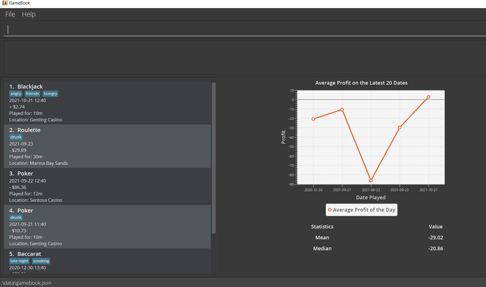

**GameBook is a desktop app designed for you to track your gambling performance.**
With simple commands, you will be able to add your gambling sessions into GameBook and view instant analysis of your gambling records.
While it has a GUI, most of the user interactions happen using a CLI (Command Line Interface).

* If you are interested in using GameBook, head over to the [_Quick Start_ section of the **User Guide**](UserGuide.html#quick-start).
* If you are interested about developing GameBook, the [**Developer Guide**](DeveloperGuide.html) is a good place to start.

**Acknowledgements**

GameBook is based on [_AddressBook Level-3_](https://github.com/se-edu/addressbook-level3) developed by the [_SE-EDU initiative_](https://se-education.org/)

Libraries used: [JavaFX](https://openjfx.io/), [Jackson](https://github.com/FasterXML/jackson), [JUnit5](https://github.com/junit-team/junit5)

Some code adapted from [http://code.makery.ch/library/javafx-8-tutorial/](#http://code.makery.ch/library/javafx-8-tutorial/) by Marco Jakob

Copyright by Gil Kalai - [https://gilkalai.wordpress.com/](#https://gilkalai.wordpress.com/)
- gamebook_icon.png

Copyright by Jan Jan Kovařík - [http://glyphicons.com/](#http://glyphicons.com/)
- calendar.png
- edit.png
